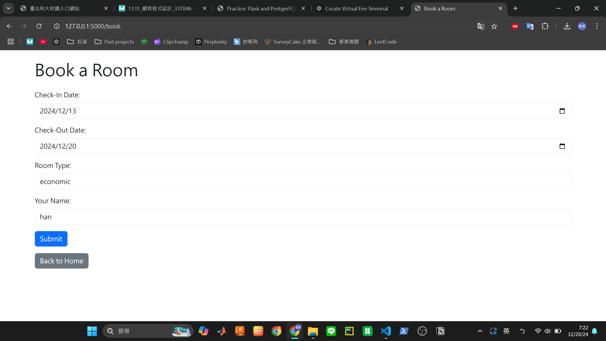

# Hotel Booking System

This is a hotel booking system built with Flask and PostgreSQL, allowing users to view current bookings, submit new bookings, and ensure booking form validation.




---

## Project Overview

This project implements a simple hotel booking website with the following key features:

- **Booking Page**: Users can submit booking information (check-in date, check-out date, room type, name).
- **Validation Functionality**: Ensures the submitted check-out date is later than the check-in date.
- **Homepage Display**: Dynamically displays current booking information and supports deleting bookings.
- **Responsive Design**: Utilizes Bootstrap for a better user interface experience.

---

## Features

1. **Homepage**:
   - Dynamically displays all booking information.
   - Supports deleting bookings.

2. **Booking Functionality**:
   - Users fill out a form to submit new bookings.
   - Form fields include:
     - Check-in date
     - Check-out date
     - Room type
     - User name.

3. **Validation System**:
   - Ensures the check-out date is later than the check-in date.
   - Displays error messages when the submission is invalid.

4. **Beautiful Interface**:
   - Built with Bootstrap for a responsive and modern design.

---

## Installation Steps

### 1. Prerequisites
Ensure you have the following installed:
- **Python 3.8+**
- **PostgreSQL**

### 2. Clone the Project
```bash
git clone <project-repository-url>
cd <project-directory>
```

### 3. Create a Virtual Environment and Install Dependencies
```bash
python -m venv venv
source venv/bin/activate  # Mac/Linux
venv\Scripts\activate     # Windows

pip install -r requirements.txt
```

### 4. Set Up the Database
1. Start PostgreSQL and create a database, e.g., hotel_booking.
2. Ensure the database connection is correctly configured in app.py:
    ```python
    app.config['SQLALCHEMY_DATABASE_URI'] = 'postgresql://<username>:<password>@localhost:5432/hotel_booking'
    ```

3. Initialize the database
    ```bash
    flask init-db
    ```

### 5. Start the Application
Run the Flask app:
```bash
flask run
```

---

## Project Structure
```csharp
project/
│
├── app.py               # Main application file
├── templates/           # HTML templates
│   ├── index.html       # Homepage template
│   └── booking.html     # Booking page template
├── static/              # empty
├── requirements.txt     # Python dependencies
└── README.md            # Project documentation
```

