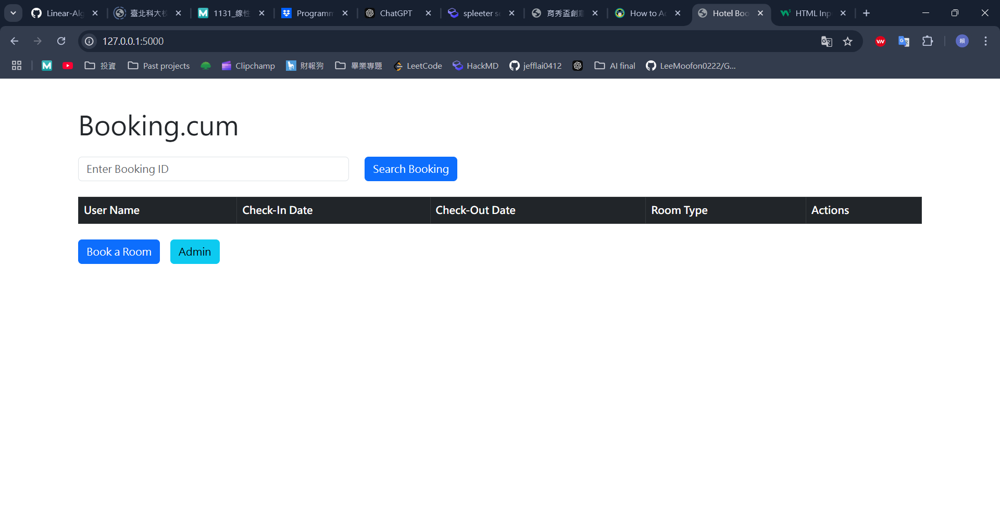

# Hotel Booking System

This is a hotel booking system built with Flask and PostgreSQL, allowing users to view current bookings, submit new bookings, validate form inputs, and access an admin interface for advanced booking searches.

### Home Page
  
### Booking Page
  
### Admin Page
  

---

## Project Overview

This project implements a simple hotel booking website with the following key features:

- **Booking Page**: Users can submit booking information (check-in date, check-out date, room type, name).
- **Validation Functionality**: Ensures the submitted check-out date is later than the check-in date.
- **Homepage Display**: Dynamically displays current booking information and supports deleting bookings.
- **Admin Interface**: Allows searching and filtering bookings based on specific criteria.
- **Responsive Design**: Utilizes Bootstrap for a better user interface experience.

---

## Features

1. **Homepage**:
   - Dynamically displays all booking information.
   - Allows deleting bookings.
   - Provides a search form to check the status of a specific booking by ID.
   - Displays success or error messages based on the search result.

2. **Booking Functionality**:
   - Users fill out a form to submit new bookings.
   - Form fields include:
     - Check-in date
     - Check-out date
     - Room type
     - User name.
   - Validates that the check-out date is later than the check-in date.
   - Ensures the check-in and check-out dates cannot be in the past.

3. **Admin Interface**:
   - A dedicated page for advanced booking searches.
   - Supports filtering bookings by:
     - Booking ID
     - Guest Name
     - Date Range (Date From and Date To).
   - Displays results in a structured table.
   - Provides a "Back to Home" button for navigation.

4. **Validation System**:
   - Ensures the check-out date is later than the check-in date.
   - Prevents past dates in the booking form by setting a minimum date for check-in and check-out.

5. **Beautiful Interface**:
   - Built with Bootstrap for a responsive and modern design.
   - Includes flash messages for user feedback.

---

## Installation Steps

### 1. Prerequisites
Ensure you have the following installed:
- **Python 3.8+**
- **PostgreSQL**

### 2. Clone the Project
```bash
git clone <project-repository-url>
cd <project-directory>
```

### 3. Create a Virtual Environment and Install Dependencies
```bash
python -m venv venv
source venv/bin/activate  # Mac/Linux
venv\Scripts\activate     # Windows

pip install -r requirements.txt
```

### 4. Set Up the Database
1. Start PostgreSQL and create a database, e.g., `hotel_booking`.
2. Ensure the database connection is correctly configured in `app.py`:
    ```python
    app.config['SQLALCHEMY_DATABASE_URI'] = 'postgresql://<username>:<password>@localhost:5432/hotel_booking'
    ```

3. Initialize the database:
    ```bash
    flask init-db
    ```

### 5. Start the Application
Run the Flask app:
```bash
flask run
```

---

## Project Structure
```plaintext
project/
│
├── app.py               # Main application file
├── templates/           # HTML templates
│   ├── index.html       # Homepage template
│   ├── booking.html     # Booking page template
│   └── admin.html       # Admin page template
├── static/              # Static files (empty in this project)
├── requirements.txt     # Python dependencies
└── README.md            # Project documentation
```

---

## Additional Features

- **Admin Page Enhancements**:
  - Advanced search options, allowing filtering by booking ID, guest name, and date range.
  - Dynamic search results displayed in a responsive table.
  - Includes navigation to return to the homepage.

- **User-Friendly Date Validation**:
  - The booking form ensures that users cannot select past dates for check-in or check-out.

- **Detailed Feedback with Flash Messages**:
  - Provides success or error messages when users interact with forms (e.g., booking, searching, deleting).

- **Error Handling**:
  - Gracefully handles invalid booking IDs or server issues, ensuring a smooth user experience.

- **Modern Interface**:
  - Leverages Bootstrap to create a clean, intuitive, and responsive design.
